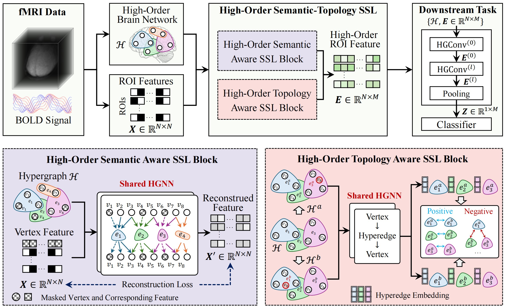

<h2 align="center">Hypergraph-Based Semantic and Topological Self-Supervised Learning for Brain Disease Diagnosis</h2>

<p align="center">
  <b>Xiangmin Han<sup>1</sup>, Mengqi Lei<sup>2</sup>, Junchang Li<sup>3</sup></b>
</p>

<p align="center">
  <sup>1</sup>School of Software, Tsinghua University<br>
  <sup>2</sup>School of Computer Science, China University of Geosciences<br>
  <sup>3</sup>Shenzhen Clinical Research Center for Mental Disorders, Shenzhen Mental Health Center, Shenzhen Kangning Hospital<br>
</p>

## Overview
<div>
    
</div>

**Figure 1. The framework of the proposed HGST.**


**_Abstract -_** Brain networks exhibit complex multi-view interactions, and accurately modeling these interactions is crucial for enhancing the accuracy of brain disease diagnosis. However, existing self-supervised learning methods often overlook the high-order topological and semantic information within brain networks, limiting the performance of pretrained model embeddings. To address this critical issue, we propose a Hypergraph-Based Semantic and Topological Self-Supervised Learning method (HGST) for brain disease diagnosis. This approach leverages hypergraph structures to model high-order functional brain networks and employs hypergraph self-supervised learning to extract latent topological and semantic information from these networks, generating high-order embedding representations that are ultimately applied to downstream brain disease diagnostic tasks. Specifically, HGST consists of two core components: a high-order semantic-aware module based on hypergraph link prediction and a high-order topology-aware module based on hyperedge structure similarity measurement. The former learns high-order embedding of brain regions by restoring masked node features, while the latter captures local topological associations within the brain network by measuring the similarity of hyperedges composed of multiple brain regions. Finally, we utilize the pretrained shared hypergraph neural network as an encoder for downstream tasks, extracting high-order brain network embeddings for each subject to assist in brain disease diagnosis. This method was validated on two public brain disease datasets, ADHD and MDD, demonstrating that HGST significantly outperforms existing methods in diagnostic performance. Additionally, we visualized the high-order brain networks generated by hypergraph self-supervised learning and identified key biomarkers related to the diseases in both ADHD and MDD, further validating the effectiveness and interpretability of our approach.


## Getting Started

### 1. Data Preparation

#### (1) ADHD Dataset

The ADHD dataset should be organised as follows:

```text
ADHD
 ┣ ADHD_all
 ┃ ┣ patient1
 ┃ ┃ ┣ rest_1_aal_TCs_1.1D
 ┃ ┃ ┣ rest_1_aal_TCs_2.1D
 ┃ ┃ ┣ ...
 ┃ ┃ ┣ rest_2_aal_TCs_m1.1D
 ┃ ┣ patient2
 ...
 ┃ ┗ patient_n
 ┃ ┃ ┣ rest_1_aal_TCs_1.1D
 ┃ ┃ ┣ rest_1_aal_TCs_2.1D
 ┃ ┃ ┣ ...
 ┃ ┃ ┣ rest_2_aal_TCs_mn.1D
 ┗ ADHD_labels.csv  # labels
```

#### (2) MDD Dataset
The MDD dataset should be organised as follows:
```text
MDD
 ┣ ROISignals_FunImgARCWF
 ┃ ┣ ROISignals_S1-1-0001.mat
 ┃ ┣ ROISignals_S1-1-0002.mat
 ┃ ┣ ...
 ┃ ┗ ROISignals_ST-K-XXXX.mat
 ┣ MDD.npy
 ┗REST-meta-MDD-PhenotypicData_WithHAMDSubItem_V4.csv   # labels
```
### 2. Environment Setup

Detailed requirements are provided in the `requirements.txt` file.
The core libraries are as follows:
```text
torch==1.13.1
torchvision @ http://download.pytorch.org/whl/cu113/torchvision-0.12.0%2Bcu113-cp38-cp38-linux_x86_64.whl
dhg==0.9.4
nibabel==5.2.1
nilearn==0.10.4
scikit-learn==1.3.2
```

### 3. Training and Testing

First, use the `constr_edges_sparse.py` script to generate hyperedges for each sample based on the sparse representation method, and save them in the `src/hyperedges` folder.
```bash 
python constr_edges_sparse.py
```

Then, use the `pretrain_and_tune.py` script for model pre-training, downstream fine-tuning, and evaluation. You can set training parameters in the command line.
```bash
python pretrain_and_tune.py
```


## Cite our work
```bibtex
Coming soon...
```

## License
The source code is free for research and education use only. Any comercial use should get formal permission first.

